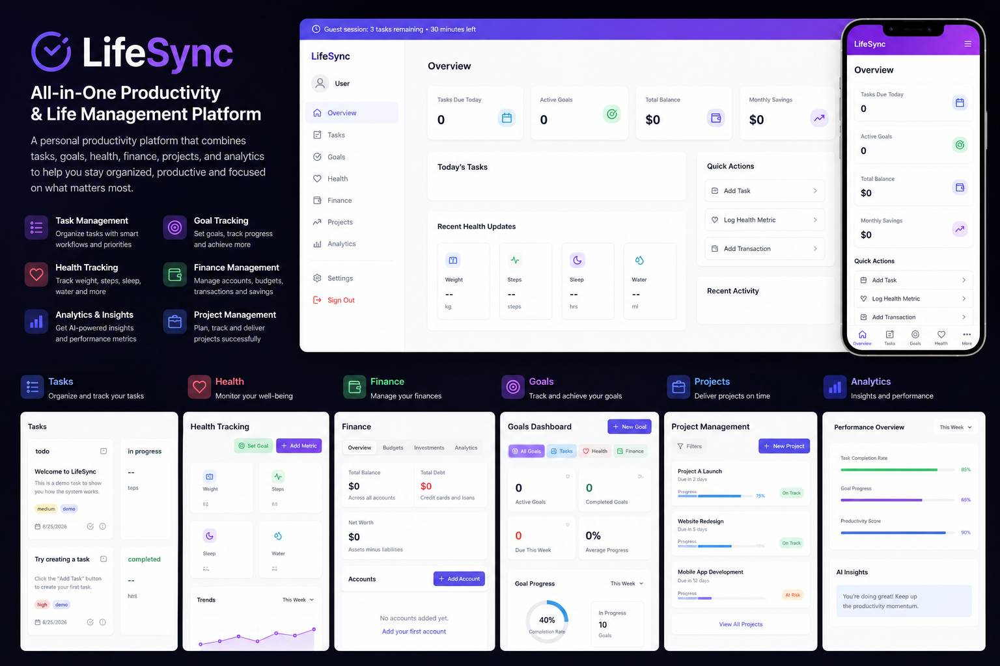

<div align="center">

# ⚡ LifeSync

### Full-Stack Life Management Platform

A modern platform that brings **tasks, health, finance, productivity, and AI-powered features** into one unified application.

[](https://lifesyncdevnew.netlify.app)
[](https://www.typescriptlang.org/)

</div>

---

## 🖥️ Application Preview

<div align="center">

<a href="https://lifesyncdevnew.netlify.app">
  
</a>

**[→ Explore the Live Application](https://lifesyncdevnew.netlify.app)**

</div>

---

## 🚀 About LifeSync

LifeSync is a full-stack life-management application designed to centralize important areas of everyday life within a single digital workspace.

Instead of managing tasks, health information, financial activity, and productivity across disconnected tools, LifeSync provides a unified interface backed by a structured cloud database and modern web architecture.

The project demonstrates practical experience building a larger TypeScript application with authentication, persistent data, relational database design, reusable frontend architecture, and cloud deployment.

---

## ✨ Core Features

| Area | Functionality |
|---|---|
| ✅ **Task Management** | Organize and manage personal tasks and productivity workflows |
| ❤️ **Health** | Track and manage health-related information |
| 💰 **Finance** | Centralize personal financial information and activity |
| 🤖 **AI Features** | AI-integrated functionality designed to enhance the user experience |
| 🔐 **Authentication** | User authentication and protected application data |
| ☁️ **Cloud Data** | Persistent backend powered by Supabase and PostgreSQL |
| 📱 **Responsive UI** | Interface designed for different screen sizes |
| ⚡ **Modern Frontend** | Type-safe, component-driven React application |

---

## 🛠️ Tech Stack

### Frontend


### Backend & Data


### Development & Deployment


---

## 🏗️ Architecture

LifeSync follows a modern frontend/cloud-backend architecture:

```text
┌─────────────────────────────┐
│        React + Vite         │
│         TypeScript          │
│        Tailwind CSS         │
└──────────────┬──────────────┘
               │
               ▼
┌─────────────────────────────┐
│          Supabase           │
│                             │
│  Authentication             │
│  Application Data           │
│  Database Access            │
│  Security Policies          │
└──────────────┬──────────────┘
               │
               ▼
┌─────────────────────────────┐
│         PostgreSQL          │
│    Relational Data Layer    │
└─────────────────────────────┘
```

The frontend is built primarily in TypeScript and communicates with Supabase for backend services and persistent application data.

---

## 🗄️ Database & Security

The project uses **Supabase with PostgreSQL** as its backend data layer.

The repository includes database-related configuration and migrations under:

```text
supabase/
```

Environment-specific credentials are excluded from source control and supplied through environment variables.

The application architecture separates frontend code from backend data and authentication concerns while using Supabase security capabilities to control access to application data.

---

## 📁 Project Structure

```text
lifesync/
│
├── .github/
│   └── workflows/          # GitHub Actions workflows
│
├── docs/
│   └── screenshots/        # README documentation assets
│
├── src/                    # Application source code
├── supabase/               # Database configuration and migrations
│
├── index.html
├── package.json
├── tailwind.config.js
├── tsconfig.json
└── vite.config.ts
```

---

## 💻 Local Development

### 1. Clone the repository

```bash
git clone https://github.com/ameerjawa/lifesync.git
cd lifesync
```

### 2. Install dependencies

```bash
npm install
```

### 3. Configure environment variables

Create a local environment file based on the variables required by the application.

```text
.env
```

> Environment credentials and production secrets are intentionally excluded from source control.

### 4. Start the development server

```bash
npm run dev
```

Vite will provide the local development URL in the terminal.

---

## 🌐 Deployment

LifeSync is deployed on **Netlify** with its backend and persistent data services provided through **Supabase**.

### Live Application

**https://lifesyncdevnew.netlify.app**

---

## 🎯 Engineering Focus

LifeSync demonstrates experience with:

- Building larger applications with React and TypeScript
- Component-driven frontend architecture
- Relational data modeling with PostgreSQL
- Supabase backend integration
- Authentication and user-specific application data
- Database migrations and security policies
- Responsive application interfaces
- Environment-based configuration
- GitHub-based development workflows
- Production web deployment

---

## 🔒 Environment & Security

Sensitive configuration is not committed to the repository.

Environment files are excluded through `.gitignore`:

```text
.env
.env.*
```

Developers should configure the required environment variables locally or through their deployment environment.

---

<div align="center">

## 👨‍💻 Author

**Ameer Jawabra**

Full Stack Software Engineer · Ontario, Canada

[Portfolio](https://ameerjawabra.com) • [GitHub](https://github.com/ameerjawa) • [Live Demo](https://lifesyncdevnew.netlify.app)

---

*Designed and developed as a full-stack software engineering project.*

</div>
